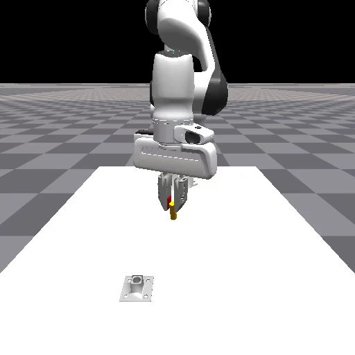
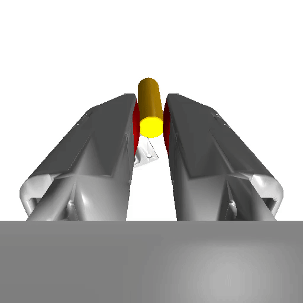

## TacSL: A Library for Visuo-tactile Sensor Simulation and Learning

This documentation provides an overview of TacSL, a library containing a tactile sensor simulation module, an insertion task environment with a tactile-enabled robot and various camera sensors, and policy training code used in Akinola and Xu et al., "TacSL: A Library for Visuotactile Sensor Simulation and Learning" (2024).

We assume user familiarity with Isaac Gym. Additionally,it may be helpful to review the [Factory tasks](./factory.md) and  [IndustReal tasks](./industreal.md), as the TacSL task environment shares a similar code structure and reuses some modules and assets from these works.

<table align="center">
    <tr>
        <th>Front Camera</th>
        <th>Wrist Camera</th>
        <th>Left Finger Tactile Camera</th>
        <th>Right Finger Tactile Camera</th>
    </tr>
    <tr>
        <td></th>
        <td></th>
        <td></th>
        <td></th>
    </tr>
</table>

---

## Overview

TacSL enables training contact-rich policies with different observation modalities such as robot proprioception, camera images, tactile RGB sensors, and tactile force fields.
To achieve this, TacSL uses a dictionary of tensors to specify policy observation inputs, allowing the policy to have multimodal inputs, i.e., observation modes with different dimensionalities such as robot proprioception vectors and 2D image inputs.
This way, the user can specify different observation modalities for different training runs and applications.

---


The core configuration files are:
- task configuration file: [TacSLTaskInsertion.yaml](../isaacgymenvs/cfg/task/TacSLTaskInsertion.yaml)
- training algorithm (PPO) configuration file: [TacSLTaskInsertionPPO_LSTM_dict_AAC.yaml](../isaacgymenvs/cfg/train/TacSLTaskInsertionPPO_LSTM_dict_AAC.yaml)


---

## Training a policy
To train a state-based policy with full privilege information available in simulation:

```commandline
python train.py \
    'task=TacSLTaskInsertion' 'task.env.task_type=insertion' \
    'seed=-1' 'task.env.use_gelsight=True' 'headless=True' \
    'max_iterations=1500' 'task.env.numEnvs=512' \
    'task.randomize.plug_noise_rot_in_gripper=[0.0, 0.628318, 0.0]' \
    'train=TacSLTaskInsertionPPO_LSTM_dict_AAC' 'train.params.config.horizon_length=512' \
    'train.params.config.mini_epochs=4' \
    +'task.env.obsDims={ee_pos:[3],ee_quat:[4],socket_pos:[3],socket_quat:[4],dof_pos:[9]}' \
    +'train.params.network.input_preprocessors={ee_pos:{},ee_quat:{},socket_pos:{},socket_quat:{},dof_pos:{}}' \
    'task.rl.asymmetric_observations=True' 'task.rl.add_contact_info_to_aac_states=True' \
    +'task.env.stateDims={ee_pos:[3],ee_quat:[4],plug_pos:[3],plug_quat:[4],socket_pos_gt:[3],socket_quat:[4],dof_pos:[9],ee_lin_vel:[3],ee_ang_vel:[3],plug_socket_force:[3],plug_left_elastomer_force:[3],plug_right_elastomer_force:[3]}' \
    +'train.params.config.central_value_config.network.input_preprocessors={ee_pos:{},ee_quat:{},plug_pos:{},plug_quat:{},socket_pos_gt:{},socket_quat:{},dof_pos:{},ee_lin_vel:{},ee_ang_vel:{},plug_socket_force:{},plug_left_elastomer_force:{},plug_right_elastomer_force:{}}' \
    'task.rl.add_contact_force_plug_decomposed=True' \
    +'task.env.obsDims={plug_pos:[3],plug_quat:[4],plug_socket_force:[3],plug_left_elastomer_force:[3],plug_right_elastomer_force:[3]}' \
    +'train.params.network.input_preprocessors={plug_pos:{},plug_quat:{},plug_socket_force:{},plug_left_elastomer_force:{},plug_right_elastomer_force:{}}' \
    experiment=insert_full_state

```

Note that the launch arguments specifies task configuration params (`task.xxx`)
as well as train params (`train.yyy`).
For example, to specify observation modality,
- specify the environment observation with: `task.env.obsDims={...}`
- specify the algorithm network input with: `train.params.config.central_value_config.network.input_preprocessors={...}`


To train a image-based policy (tactile image):

```commandline
python train.py \
    'task=TacSLTaskInsertion' 'task.env.task_type=insertion' \
    'seed=-1' 'task.env.use_gelsight=True' 'headless=True' \
    'max_iterations=1500' 'task.env.numEnvs=64' \
    'task.randomize.plug_noise_rot_in_gripper=[0.0, 0.628318, 0.0]' \
    'train=TacSLTaskInsertionPPO_LSTM_dict_AAC' 'train.params.config.horizon_length=512' \
    'train.params.config.mini_epochs=4' \
    +'task.env.obsDims={ee_pos:[3],ee_quat:[4],socket_pos:[3],socket_quat:[4],dof_pos:[9]}' \
    +'train.params.network.input_preprocessors={ee_pos:{},ee_quat:{},socket_pos:{},socket_quat:{},dof_pos:{}}' \
    'task.rl.asymmetric_observations=True' 'task.rl.add_contact_info_to_aac_states=True' \
    +'task.env.stateDims={ee_pos:[3],ee_quat:[4],plug_pos:[3],plug_quat:[4],socket_pos_gt:[3],socket_quat:[4],dof_pos:[9],ee_lin_vel:[3],ee_ang_vel:[3],plug_socket_force:[3],plug_left_elastomer_force:[3],plug_right_elastomer_force:[3]}' \
    +'train.params.config.central_value_config.network.input_preprocessors={ee_pos:{},ee_quat:{},plug_pos:{},plug_quat:{},socket_pos_gt:{},socket_quat:{},dof_pos:{},ee_lin_vel:{},ee_ang_vel:{},plug_socket_force:{},plug_left_elastomer_force:{},plug_right_elastomer_force:{}}' \
    'task.rl.add_contact_force_plug_decomposed=True' \
    'task.env.use_camera_obs=True' 'task.env.use_camera=False' 'task.env.use_isaac_gym_tactile=True' \
    +'task.env.obsDims={left_tactile_camera_taxim:[80,60,3], right_tactile_camera_taxim:[80,60,3]}' \
    +'train.params.network.input_preprocessors={left_tactile_camera_taxim:{cnn:{type:conv2d_spatial_softargmax,activation:relu,initializer:{name:default},regularizer:{name:'None'},convs:[{filters:32,kernel_size:8,strides:2,padding:0},{filters:64,kernel_size:4,strides:1,padding:0},{filters:64,kernel_size:3,strides:1,padding:0}]}},right_tactile_camera_taxim:{cnn:{type:conv2d_spatial_softargmax,activation:relu,initializer:{name:default},regularizer:{name:'None'},convs:[{filters:32,kernel_size:8,strides:2,padding:0},{filters:64,kernel_size:4,strides:1,padding:0},{filters:64,kernel_size:3,strides:1,padding:0}]}}}' \
    experiment=insert_tactile
```

To train a image-based policy (wrist-camera image):

```commandline
python train.py \
    'task=TacSLTaskInsertion' 'task.env.task_type=insertion' \
    'seed=-1' 'task.env.use_gelsight=True' 'headless=True' \
    'max_iterations=1500' 'task.env.numEnvs=64' \
    'task.randomize.plug_noise_rot_in_gripper=[0.0, 0.628318, 0.0]' \
    'train=TacSLTaskInsertionPPO_LSTM_dict_AAC' 'train.params.config.horizon_length=512' \
    'train.params.config.mini_epochs=4' \
    +'task.env.obsDims={ee_pos:[3],ee_quat:[4],socket_pos:[3],socket_quat:[4],dof_pos:[9]}' \
    +'train.params.network.input_preprocessors={ee_pos:{},ee_quat:{},socket_pos:{},socket_quat:{},dof_pos:{}}' \
    'task.rl.asymmetric_observations=True' 'task.rl.add_contact_info_to_aac_states=True' \
    +'task.env.stateDims={ee_pos:[3],ee_quat:[4],plug_pos:[3],plug_quat:[4],socket_pos_gt:[3],socket_quat:[4],dof_pos:[9],ee_lin_vel:[3],ee_ang_vel:[3],plug_socket_force:[3],plug_left_elastomer_force:[3],plug_right_elastomer_force:[3]}' \
    +'train.params.config.central_value_config.network.input_preprocessors={ee_pos:{},ee_quat:{},plug_pos:{},plug_quat:{},socket_pos_gt:{},socket_quat:{},dof_pos:{},ee_lin_vel:{},ee_ang_vel:{},plug_socket_force:{},plug_left_elastomer_force:{},plug_right_elastomer_force:{}}' \
    'task.rl.add_contact_force_plug_decomposed=True' \
    'task.env.use_camera_obs=True' 'task.env.use_camera=True' 'task.env.use_isaac_gym_tactile=False' \
    +'task.env.obsDims={wrist:[64,64,3]}' \
    +'train.params.network.input_preprocessors={wrist:{cnn:{type:conv2d_spatial_softargmax,activation:relu,initializer:{name:default},regularizer:{name:'None'},convs:[{filters:32,kernel_size:8,strides:2,padding:0},{filters:64,kernel_size:4,strides:1,padding:0},{filters:64,kernel_size:3,strides:1,padding:0}]}}}' \
    experiment=insert_wrist
```

---

## Testing a trained policy
```commandline
python train.py \
    --config-path runs/insert_full_state \
    --config-name config.yaml --config-dir cfg \
    checkpoint=runs/insert_full_state/nn/insert_full_state.pth \
    test=True headless=False task.env.numEnvs=16
```

### AACD Algorithm
Training image-based policies

Reinforcement learning (RL) from high-dimensional observation modalities, such as images, is challenging due to what's known as the curse of dimensionality. This phenomenon makes exploration more demanding and complicates the learning process. The challenge becomes even more pronounced when tackling contact-rich tasks with RL. In scenarios where the agent must apply appropriate force while minimizing aggressive forces, we observed that contact penalties can significantly impede exploration. Agents tend to conservatively avoid contacts, making it difficult to discern between favorable and unfavorable states in high-dimensional space.

Inspired by the teacher-student framework, asymmetric actor critic-distillation algorithm (AACD)  leverages a pre-trained critic from a low-dimensional agent to guide the learning process of a new high-dimension agent. This approach effectively addresses the exploration challenge, particularly in learning contact-rich tasks with high-dimensional observation inputs.


AACD trains a high-dimensional policy through two stages:
- First, both a low-dimensional RL actor and critic, initialized randomly, are trained from scratch using low-dimensional privileged state information.
- Second, a high-dimensional actor, also randomly initialized, and the pre-trained low-dimensional critic are trained and fine-tuned, respectively, to optimize RL policy objectives.

For the second stage, the training launch command should include:
- the policy checkpoint of the previously trained state-based policy e.g. `checkpoint=runs/insert_full_state/nn/insert_full_state.pth`
- the flag to load the critic from this checkpoint i.e. `+load_critic_only=True`
- the observation and network for the new high-dimensional actor.
You can optionally freeze the critic with: `+train.params.config.central_value_config.freeze_critic=False`


### Image augmentation
TacSL also includes a fast [implementation](../isaacgymenvs/task/tacsl/tacsl_task_image_augmentation.py) of different image augmentation operations, including:
- Color channel swapping: This randomly swaps RGB channels. The swap order is kept the same across the length of an episode i.e. a different swap order is sampled for each parallel environment at the beginning of the episode, and this swap order is applied at each time-step until the end of the episode. Usage: `task.randomize.randomize_color_channel=True`
- Color-jitter: Adapted from torchvision, this randomizes the image color along four dimensions: [brightness, contrast, saturation, hue]. The TacSL implementation enables applying the same augmentation within an episode, analogous to sampling a new tactile sensor with a different coloration.
  Usage:
   - `task.randomize.use_ep_image_aug=True` turns on color jitter at the episode level.
   - `task.randomize.use_ep_image_aug=True` turns it on to be sampled at every time-step.
   - The randomization range of the color jitter is specified with: `'task.randomize.ep_color_aug_bcsh_level=[.0, .0, .0, .0]'`  for episode-level jitter and  `'task.randomize.t_color_aug_bcsh_level=[.0, .0, .0, .0]'` for time-step jitter.
- RandomCrop: This randomly crops a portion of the image with a specified aspect ratio and reshapes it to the original image size. Usage:  `'task.randomize.ep_image_aug_crop_scale=[1.0, 1.0]'` and  `'task.randomize.ep_image_aug_aspect_k=[1.0, 1.0]'`


---

## Tactile Sensor Stand-alone Examples

The sensors used in TacSL are implemented in [isaacgymenvs/tacsl_sensors](../isaacgymenvs/tacsl_sensors). We also include simple examples that show how to compute both tactile RGB and tactile force fields for two different sensors, Gelsight R1.5 and Gelsight Mini. The examples can be found in  [isaacgymenvs/tacsl_sensors/examples](../isaacgymenvs/tacsl_sensors/examples).


---

## Citation

If you use any of the TacSL sensors, training environments or algorithms in your work, please
cite [TacSL](https://iakinola23.github.io/tacsl/):

```
@inproceedings{
	akinola_xu_2024tacsl,
	author = {Iretiayo Akinola^* and Jie Xu^* and Jan Carius and Dieter Fox and Yashraj Narang},
	title = {IndustReal: Transferring contact-rich assembly tasks from simulation to reality},
	booktitle = {ArXiv},
	year = {2024}
}
```

