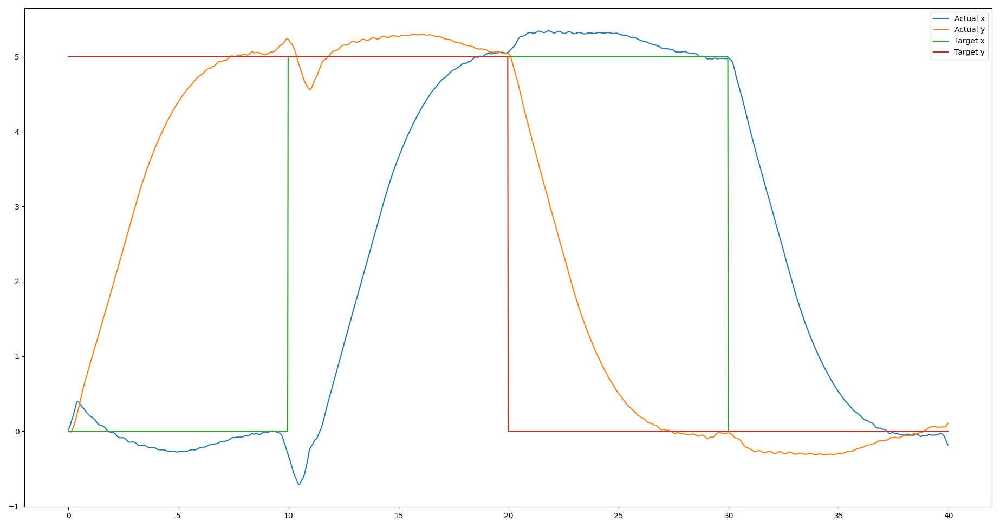

# 11 Apr Update

Continuing the work from [last time](reports/8_mar)

We managed to implement a PD control layer on top of the velocity control. This allows us to have "Go to target position" functionality. 



A video is available at this Google Drive folder under 'position_schedule.mp4': https://drive.google.com/drive/folders/1uLouNBEBipLJNS5u9tXdyZsZltJF-NeS?usp=sharing

## Reproduction

A pre-trained checkpoint `QuadrupedAMP.pth` and sample dataset `dataset.h5` is provided here. The dataset can be generated with the following command:

```
# From isaacgymenvs directory
git checkout 3d83186b3c0bc3de2d20bcdb5ee2e804dced411d 
python train.py task=QuadrupedAMP task.env.motionFile=data/motions/quadruped/a1_expert/trot/dataset_trot.yaml num_envs=1 test=True checkpoint=../reports/11_apr/QuadrupedAMP.pth headless=False task.env.task.reset.position_pd_control.enabled=True train.params.algo.name=quadruped_amp task.env.episodeLength_s=40
```

The plots can be generated as follows:
```
python plotting/plot_target_pos_schedule.py -i ../reports/11_apr/dataset.h5
```