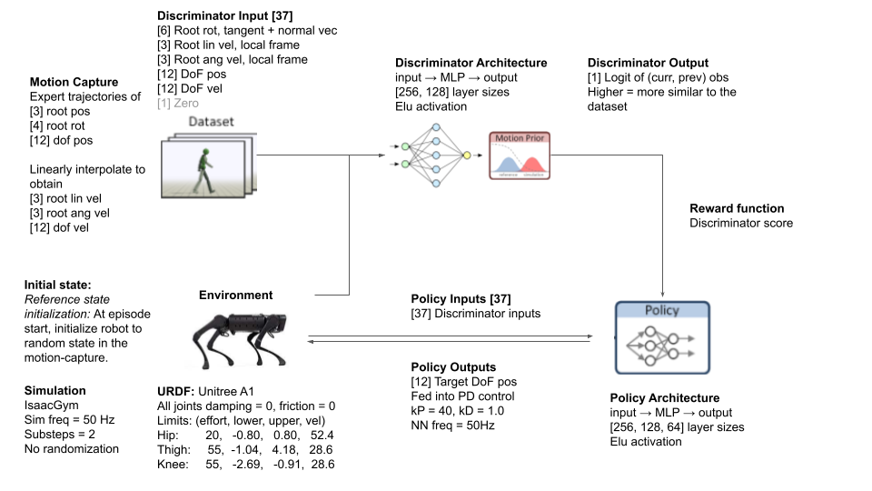
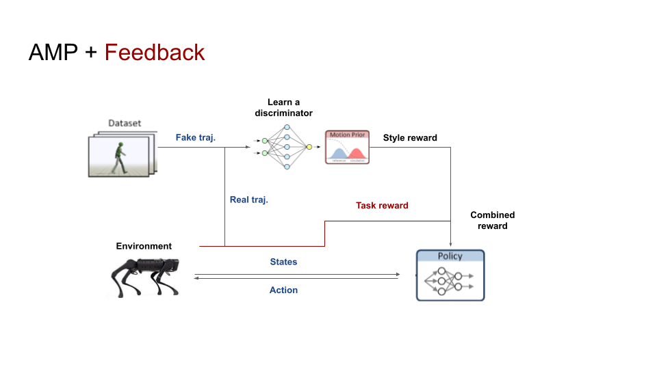
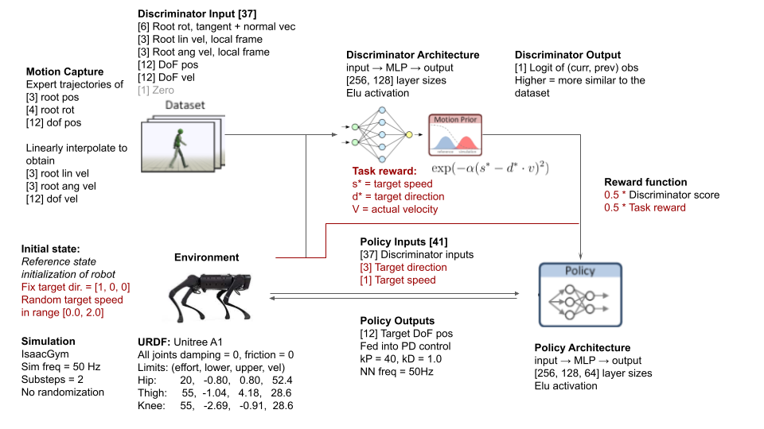
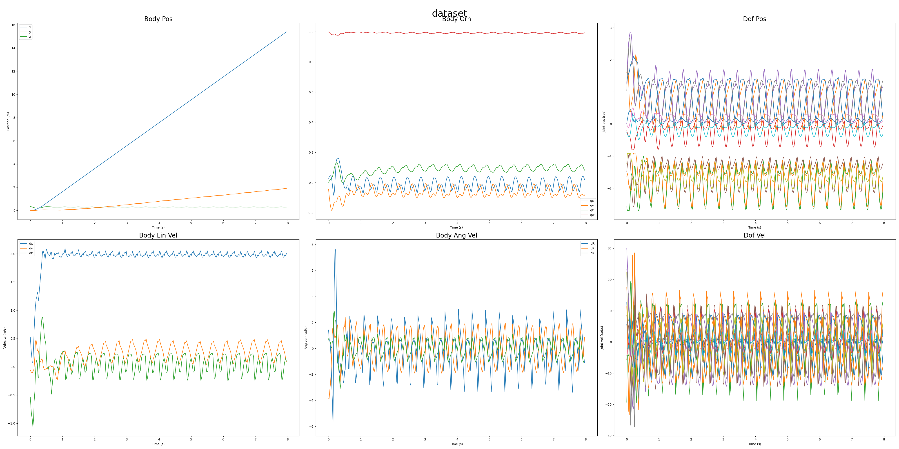
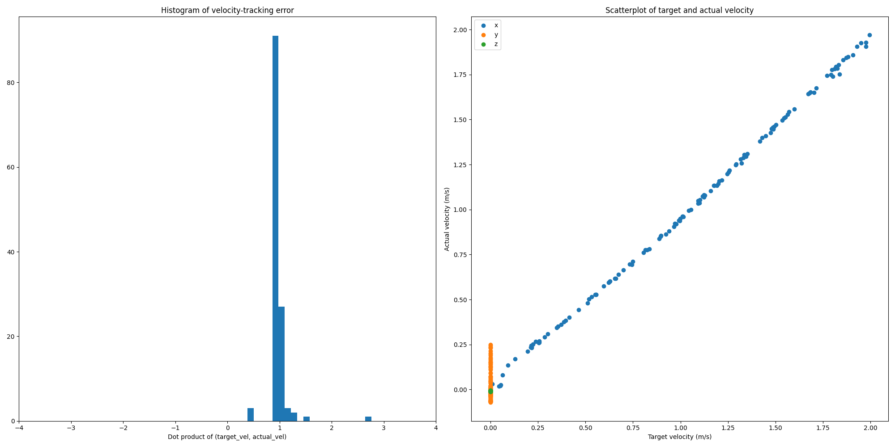

# 8 Mar Update

## Overview

This week, we're interested in implementing  for feedback-controllable policies. 


## AMP

As a recap, [adversarial motion priors (Peng, 2019)](https://arxiv.org/abs/2104.02180) are a generalized method of adversarial imitation learning. 



In place of a fixed reward function, a discriminator is used to evaluate the similarity of a policy's behaviour to a known dataset, and the logit of the real action is used as the reward. 

The benefits include: 
- Minimal reward engineering required
- Flexibly and scalably specify desirable behaviour through demonstrations

## AMP + Feedback 

Pure AMP produces non-controllable policies, in the sense that the policy's behaviour is fully determined by the initial state; i.e. we cannot influence the policy's behaviour at test time. 

To enable the policy to accept high-level commands, we can combine the AMP-derived discriminator reward with a task-specific reward, as described in [Equation 4](https://arxiv.org/abs/2104.02180). 



We implement a simple proof-of-concept for a target-velocity-following task in the `QuadrupedAMP` 

## Method



We use a reference [motion dataset](../../isaacgymenvs/data/motions/quadruped/a1_expert/trot/dataset_trot.yaml) of 8 trotting motions between the speeds of $[0.3, 1.2]$ m/s. 

To implement feedback control, we augment the policy observations with a target speed $s^*$ and unit direction vector $d^*$. We train a policy with a combined AMP-derived style reward $r_d$ and a velocity-following task reward. The velocity-following reward is described by the equation: $$r_{g} = \exp(-\alpha(s^* - d^* \cdot v)) $$, where $v$ denotes the measured instantaneous root velocity. Note that $r_g, r_d \in [0,1]$. In our experiments, $\alpha = 1.0$. The overall reward is determined as $$ r = 0.5 r_g + 0.5 r_d $$. 

## Results

### Sample Trajectory
A sample trajectory of various robot states is provided below. 


### Velocity-tracking
We evaluate velocity tracking over $N=128$ random seeds, with target direction fixed to be $[1, 0, 0]$ and target speed randomized in the range $[0., 2.] m/s$.


## Discussion

### Robustness to physical infeasibility
In half of the reference trajectories used, the motion was recorded while walking over procedurally-generated bumpy terrain, meaning that the motion is not physically feasible for a robot walking on smooth ground. Nevertheless, the policy learns to robustly reproduce the trotting motions. 

### Generalization to OoD speeds
Despite being trained only on reference motions of speeds between 0.3 and 1.2 m/s, our policy can learn to travel up to 2.0 m/s while trotting. This indicates that the learned policy does not simply memorize a reference motion, it has learned the abstract style of 'trotting' that is present in the dataset, and is able to generalize this to create out-of-distribution motions.  

A video of the learned motion is available in Google Drive: https://drive.google.com/drive/folders/1PDJyRT8ubHQzPsSWIpw_OB3GY4x6A12e?usp=sharing

## Reproduction

A pre-trained checkpoint `QuadrupedAMP.pth` and sample dataset `dataset.h5` is provided here. The dataset can be generated with the following command:

```
# From isaacgymenvs directory
git checkout 68255b45e4cd5b83fd22034540e68eb4ae767c15
python train.py task=QuadrupedAMP task.env.motionFile=data/motions/quadruped/a1_expert/trot/dataset_trot.yaml num_envs=32 test=True checkpoint=../reports/8_mar/QuadrupedAMP.pth
```

The plots can be generated as follows:
```
python plotting/plot_target_vels.py -i ../reports/8_mar/dataset.h5 -o target_vel.png
python plotting/viz_dataset.py -i ../reports/8_mar/dataset.h5 -o trajectory.png
```
